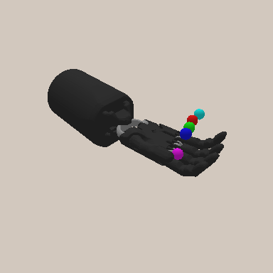
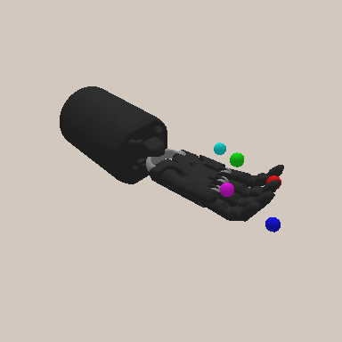
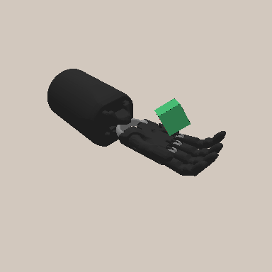

# shadowhand-gym

OpenaAI Gym Shadow Dexterous Hand robot environment based on PyBullet.  
(Successor of [Old gym environment](https://rgit.acin.tuwien.ac.at/matthias.hirschmanner/shadow_teleop/).)

[](LICENSE)
[](https://github.com/psf/black)

## Installation

### From source

```bash
git clone https://github.com/szahlner/shadowhand-gym.git
pip install -e shadowhand-gym
```

## Usage

```python
import gym
import shadowhand_gym

env = gym.make('ShadowHandReach-v1', render=True)

obs = env.reset()
done = False
while not done:
    action = env.action_space.sample()  # random action
    obs, reward, done, info = env.step(action)

env.close()
```

## Environments

| | |
| :------------------------------: | :--------------------------------------------: |
| `ShadowHandReach-v1` **easy** | `ShadowHandReach-v1` **hard** |
|  |  |
| `ShadowHandBlock-v1` **orientation** | |
|  | |

Environments are widely inspired from [OpenAI ShadowHand environments](https://openai.com/blog/ingredients-for-robotics-research/).  
Code inspired from [qgallouedec's panda-gym](https://github.com/qgallouedec/panda-gym).